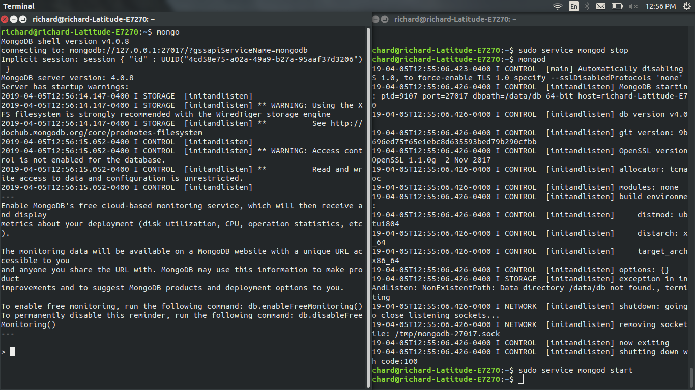
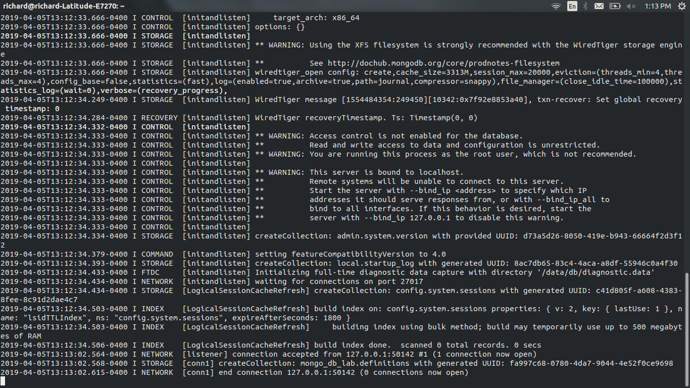
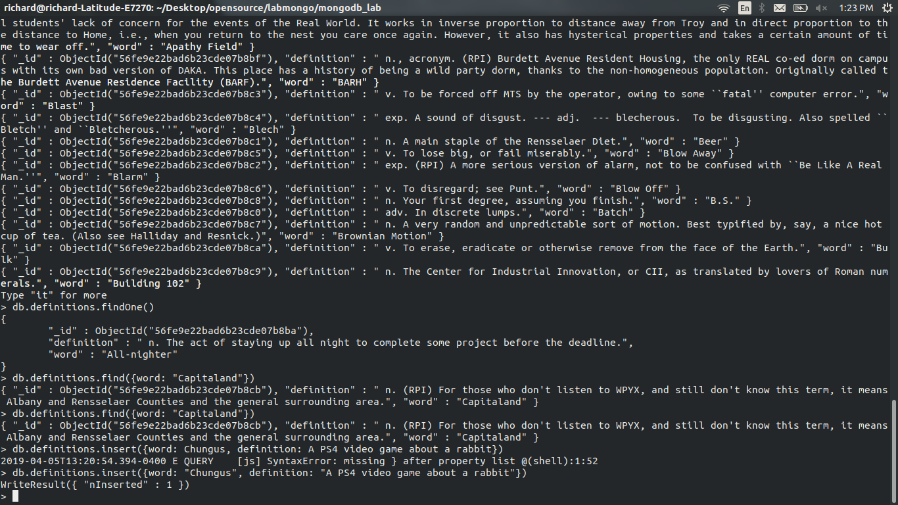
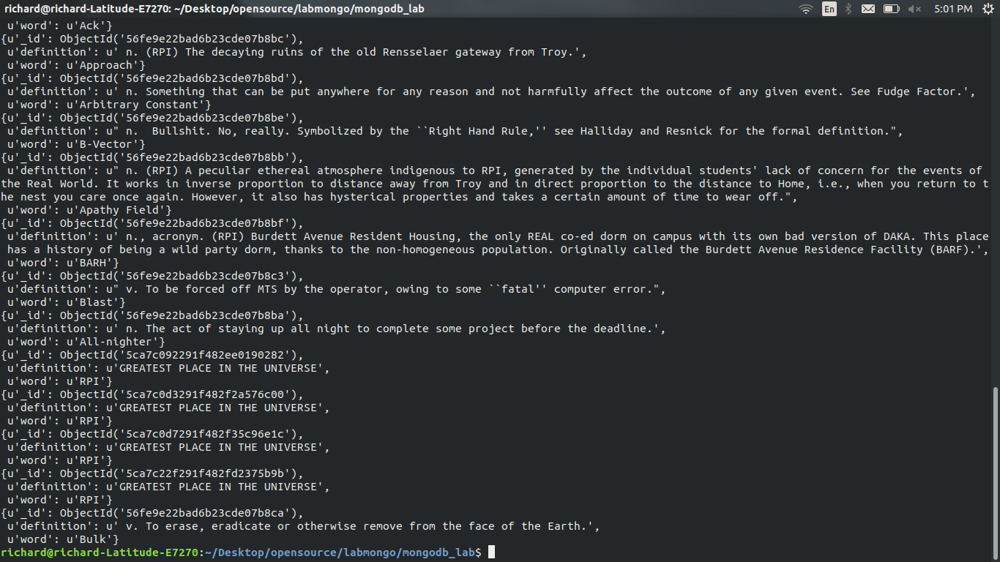
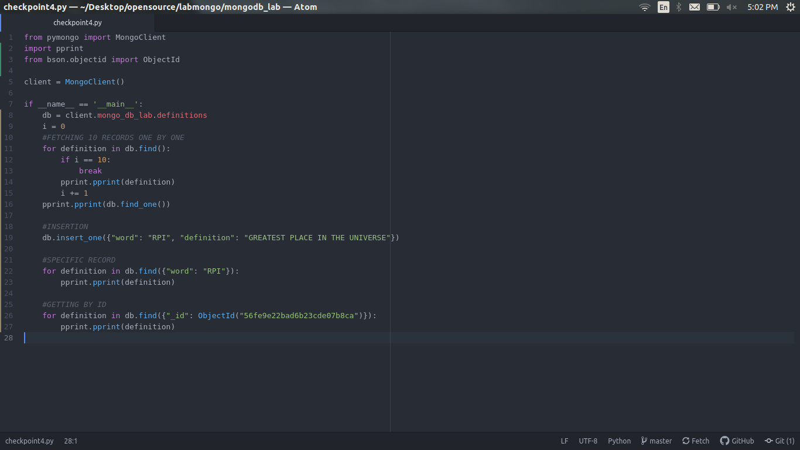

# Checkpoint  1  
I wrote sudo service mongo start which actually runs it in the background, cp2 shows an image of the command mongod working right after I fixed everything.
  

# Checkpoint 2

# Checkpoint 3

# Checkpoint 4  

# Checkpoint 5

This is complicated, I'll try to figure out how to do this part and if I can't I'll leave this message here.
